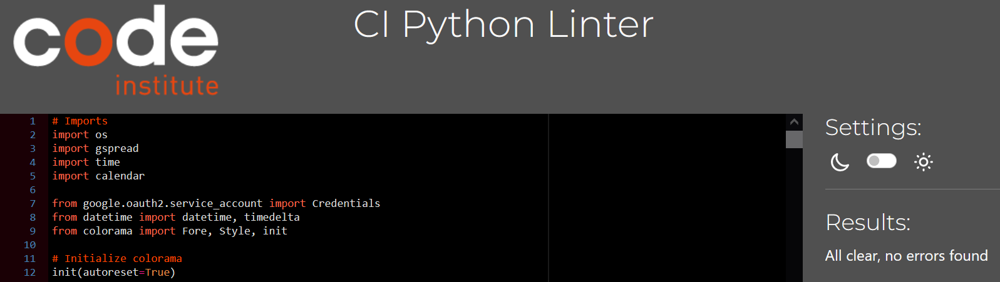

# The Budget Calculator

The Budget Calculator provides a simple yet effective solution for managing personal finances. With its intuitive interface and seamless integration with Google Sheets, users can easily track their income and expenses, enabling better financial decision-making.

The live link can be found here - [Budget Calculator](https://budget-calculator-evo-f9181bd7422d.herokuapp.com/)

## How to Use

### Installation
To run the Budget Calculator locally, follow any of these steps:

  
Fork or Clone the repository

  
How to Fork the repository

    1. Sign in to GitHub.
    2. Go to the repository for this project - EVondrus/budget-calculator
    Click the Fork button in the top right corner.

How to Clone the repository

    1. Log in (or sign up) to GitHub.
    2. Go to the repository for this project - EVondrus/budget-calculator
    3. Click on the code button, select whether you would like to clone with HTTPS, SSH or GitHub CLI and copy the link shown.
    4. Open the terminal in your code editor and change the current working directory to the location you want to use for the cloned directory.
    5. Type 'git clone' into the terminal and then paste the link you copied in step 3. Press enter.

### Guide

The Budget Calculator is designed to be simple and user-friendly, allowing you to manage your finances with ease. Here's a guide on how to use its features:

  
Step-by-step guide

- **Adding Income**
    - Choose Income Type:
        - Start by selecting whether you're adding monthly income or additional income.
    - Input Details: 
        - After selecting the income type, you'll be prompted to input the date, amount and a description for your income. For monthly income, the description is automatically set to "Monthly Income", while for additional income, you can enter a custom description. They're placed into categories of "Monthly Income" and "Extra Income" by default.
    - Confirmation: 
        - Once you've entered the details, the program will confirm the addition of your income and display a summary of the transaction.

- **Adding Expenses**
    - Select Expense: 
        - From the main menu, choose the option to add an expense.
    - Enter Details: 
        - You'll be prompted to input the date, description, amount and category of your expense. For the category, you can either select an existing category or create a new one by choosing the option to create a new category. 
        - You have the freedom to create and name your own categories from the very beginning.
    - Confirmation:
        - After entering the details, the program will confirm the addition of your expense and display a summary of the transaction.

- **Viewing Summaries**
    - Choose Summary Type:
        - From the main menu, select the option to view summaries. This will present you with various summary options.
    - Select Time Span: 
        - Depending on your choice, you can view expenses by week, month, categories, or view a summary of a chosen month or year.
        - You'll be prompted to input the month and year to select your time span. 
    - Review Summary: 
        - The program will display the requested summary, providing you with insights into your income and expenses.

- **Exiting the Program**
    - Confirm Exit:
        - From the main menu, select the option to exit the program. 
        - You'll be asked to confirm your choice to exit.
    - Exit Confirmation: 
        - If you confirm, the program will exit, and you'll be returned to your system's command line or terminal.
        - Else you'll be taken back to the menu.

## Site Owner Goals
- Provide users with a functional and user-friendly application for managing their finances efficiently.
- Encourage users to return to the application regularly by offering valuable features and insights into their financial activities.
- Foster trust and reliability by ensuring accurate data management and secure handling of sensitive financial information.

## User Stories

- ### As a user I want to:
    - Easily grasp how the Budget Calculator can help me manage my finances more effectively.
    - Be guided through the process of adding income and expenses with an interface that is both intuitive and easy to navigate.
    - Have access to a summary of my budgeting activities, including total income, total expenses, total expenses by category, and remaining balance over different time spans.
    - Start managing my finances more effectively by trying out the Budget Calculator today!

## Logic Flow
To visualize the sequence of actions needed in the budget calculator, I utilized Lucid Chart to create a flowchart. This approach proved invaluable as it enabled me to conceptualize the project's structure, delineate necessary functions, and understand the interaction among various components.

As the flow chart was created at the outset of the project, it does not fully reflect all elements of the program.

## Features

### Welcome Section:
- A friendly message welcoming the user to the application.
- The terminal is running on a background image suited for the application purpouse.
- By entering any key the user will continue to the program.

### Interactive Menu:

The program features an interactive menu that guides users through different options:
- The menu is chosen by numbers.
1. Adding income 
2. Adding expenses.
3. Viewing summaries.
4. Exit the program.

### Adding Income Entries:

To add income entries, follow these steps:
1. From the main menu, select '1' to add income.

2. You will be prompted to choose between adding monthly income or additional income. 
    - Enter '1' for monthly income or '2' for additional income.

3. You will be prompted to enter the date for the income entry.
    - If you wish to use today's date, simply press Enter.
    - Alternatively, you can input a custom date in the format DD-MM-YYYY.

3. For monthly income, the description is automatically set to "Monthly Income" and the category to "Monthly Income". 
    - For additional income, you will be prompted to enter a custom description with a set category of "Extra Income".

4. Enter the amount for the income entry.

5. The program will confirm the addition of your income and display a summary of the transaction.

### Adding Expense Entries:

1. From the main menu, select '2' to add an expense.

2. You will be prompted to enter the date for the expense entry.
    - If you wish to use today's date, simply press Enter.
    - Alternatively, you can input a custom date in the format DD-MM-YYYY.

3.  Enter a description for the expense. This should be a brief note about the expense, eg. name of the store or product.

4. Enter the amount for the expense entry. The program will validate that the amount is a positive number.
    - If the input is not valid, you will be prompted to re-enter the amount.

5. You will be presented with a list of your previoulsy created expense categories.
    - Enter the number corresponding to the category you wish to use for your expense.
    - If you need to create a new category, select the option to create a new category and enter the name of the new category when prompted.

6. The program will confirm the addition of your expense and display a summary of the transaction.

### Viewing Summary:

1. From the main menu, select '3' to view summaries.

2. You will be presented with several options for the type of summary you wish to view:
    - View all expenses by month: Select this option to see a summary of all your expenses categorized by month.
        - This is useful for understanding your spending habits over time.

    - View monthly expenses by category: Choose this option to see a detailed breakdown of your expenses by category for a specific month. 
        - This helps in identifying where most of your money is going.

    - View weekly expenses: Select this option to get a weekly breakdown of your expenses. 
        - This can be particularly useful for tracking spending in the current month or planning for the upcoming week.

    - View monthly and yearly summaries of income and expenses: This options provides a comprehensive overview of your income and expenses over a month or a year-
        - Offering insights into your financial health.

3. After selecting the type of summary you wish to view, you will be prompted to enter the specific month and year for which you want to view the summary. 
    - For weekly expenses, you will be prompted to enter a specific month and year to view the expenses for the weeks in that particullar month.

4. The program will display the requested summary, providing you with insights into your income and expenses. 

### Exiting the Program

To exit the Budget Calculator, follow these steps:

1. From the main menu, select '4' to exit the program.
    - You will be prompted to confirm your choice to exit.
        - Enter 'y' to confirm and exit the program.
        - Enter 'n' to cancel the exit and return to the main menu.
2. The program will recognize your input and proceed accordingly.
    - If you entered 'y', a goodbye message will appear, and the calculator will be ended using the exit() method.
    - If you entered 'n', you will return to the main menu without exiting the program.

### Date Handling:

- The program displays today's date by default.
- Users have the option to press Enter to automatically insert today's date for income and expense entries.
- Users can also choose to input their own date for income and expenses if preferred in the format DD-MM-YYYY format.

### Data Management:

- Utilizes Google Sheets API for storing income and expense data.
- Implements error handling to manage unexpected inputs or errors during execution.

### Security:

- Utilizes Google OAuth2 authentication for secure access to Google Sheets.
- Ensures that sensitive data is handled securely and only authorized users can access the budget data.

### Summary 
- Google Sheets serves as the central repository for storing and retrieving financial data. The budget calculator accesses Google Sheets via the Google Drive and Google Sheets APIs hosted on the Google Cloud Platform.

- To ensure secure access to Google Sheets, dedicated credentials were generated and stored.
- These credentials are securely managed within the cred.json file, included in the .gitignore to prevent inadvertent exposure on GitHub. 
- Additionally, they are configured as environment variables (Config Vars) on Heroku, ensuring secure access during runtime.
- This integration of Google Sheets enhances the functionality of the budget calculator, providing users with a robust platform for managing and analyzing their financial data effectively.

 

### Future Features
- Remove an unique object: A feature that allowes the user to remove a specific income, expense or category from the program.
- Expense Tracking: Implement a feature to track recurring expenses automatically, providing insights into spending patterns over time.
- Expense Analysis Tools: Develop tools for analyzing expenses to identify patterns, such as frequent spending categories or seasonal variations.
- Budget Analysis: Integrate data visualization tools to generate charts and graphs, offering users a visual representation of their budget allocation and spending habits.
- Goal Setting: Allow users to set financial goals such as saving for a vacation, buying a house, or paying off debt. The calculator can then track progress towards these goals and provide actionable insights to help achieve them.

## Data Model
In the Budget Calculator project, I employed principles of Object-Oriented Programming to create a modular and maintainable application. The application is centered around four main classes, each with a distinct responsibility.

  
Classes of the Budget Calculator

- **Entry**:
    The Entry class serves as the foundation for all financial entries, whether they are incomes or expenses. It encapsulates the common attributes and behaviors of financial entries, such as:
    - Attributes: date, description, category, and amount (post-tax).
    - Methods:
        - Initializes a new Entry object with the specified date, description, category, and amount.
        - Collects user input for date, category, description, and amount.
        - Adds a new row to the specified Google Sheets worksheet with the details of the entry.

- **IncomeEntry**:
    The IncomeEntry class inherits from the Entry class and is specifically designed to handle income entries. It includes methods for adding monthly income (with a fixed description) and additional income (allowing for a custom description).
    - Methods:
        - Adds monthly income with a fixed description of "Monthly Income" and a default category ("Monthly Income").
        - Collects user input for additional income as the user is allowed to enter a costum description with a fixed category ("Extra Income").

- **ExpenseEntry**:
    The ExpenseEntry class also inherits from the Entry class and is tailored for managing expense entries. It includes a method for adding an expense, which collects user input for the date, description, amount, and category. A crucial aspect of this class is its capability to handle category management, allowing users to either select an existing category or create a new one if necessary.
    - Methods:
        - Resposible for collecting user input for the date, description, amount, and category. 
        - Facilitates the addition of an expense to the Google Sheets expenses worksheet.
        - Incorporates functionality to allow users to choose from existing categories or to create a new category if their expense does not fit into the existing categories

- **Summary**:
    The Summary class is a pivotal component of the Budget Calculator application, offering users a comprehensive understanding of their financial situation through detailed analysis and reporting. This class is meticulously designed to generate various summaries, enabling users to track their income and expenses by week, month, and year, as well as by category.
    - Methods:
        - Filter expenses based on a specified date range, allowing users to view their spending within a particular period.
        - Calculates the total income and expenses for a given period, providing a clear overview of the financial situation.
        - Categorizes expenses and calculates the total amount spent in each category.
        - Calculating remaining income.
        - Viewing weekly and monthly expenses.
        - Viewing expenses by category.
        - Viewing monthly and yearly summaries.

## Testing

### PEP8 Testing 
The python file have all been passed through [CI Python Linter](https://pep8ci.herokuapp.com/) The files were checked with no errors. See screen show below:

All of the below tests were completed in my local terminal and also in the Heroku terminal.

### Input Testing
All user inputs in the Budget Calculator application were thoroughly tested to ensure that all input data is handled correctly and that appropriate feedback is given to the user. The testing covered various aspects of user interaction, including input validation, error handling, and the application's response to different types of input. Here's a detailed breakdown of the testing conducted:

  
View Input Tests

- Menu Options Selection: 
    - The menu options were tested to ensure that only valid numbers corresponding to the available options are selectable.
    - Additionally, when the user chooses to exit the Budget Calculator, they are prompted to input 'y' or 'n' to confirm their choice. Only lowercase letters are accepted for this confirmation. 
    - If the user inputs a number or letter that does not match any of the menu options, an error message is displayed.

    

- Date Input: 
    - The application was tested to ensure that the date input must be in the "YYYY-MM-DD" format. Inputs that do not match this format were rejected, and an error message was displayed to the user, prompting them to enter the date in the correct format.
    - If the user leave the date input empty and the press enter key, it will automaically add the chosen income or expense on todays date.

    

- Income and Expense Input:
    - The application checks that the amount entered for incomes and expenses is a positive number. If a negative number or non-numeric input is entered, an error message is displayed, and the user is prompted to enter a valid amount.
    - For additional income and expenses, the application validates that the description does not exceed a certain character limit (12 characters). If the description is too long, an error message is displayed, and the user is prompted to enter a shorter description.

    

- Category Input:
    - Category inputs must not exceed 12 characters to fit the columns in the Google sheet.
    - The application was tested to ensure that users can select an existing category from the list or create a new one. The input validation checks that the user's choice is either a valid category number or the option to create a new category. If an invalid choice is made, an error message is displayed, and the user is prompted to make a valid selection.
- Category Input:
    - Category inputs must not exceed 12 characters to fit the columns in the Google sheet.

### Other Testing
The Budget Calculator was tested thoroughly to ensure the following features worked as intended.

  
View Other Tests
 
- The application was tested to ensure that adding new income or expenses correctly updates the summary. The stored information was verified for accuracy.
- The summaries were examined to ensure they display accurate information, with proper sorting of data.
- After successful inputs and operations, the application provided appropriate feedback to the user, confirming actions taken (e.g., addition of income or expense).
- The application was tested to ensure that any category selected user exists in the list of predefined categories.
- The creation of new categories was tested so that the user is not able to create a category that alredy exists in the list.
- During testing, error messages were deliberately triggered to confirm they provide clear and relevant information to the user, aiding in troubleshooting.

## Libraries and Technologies Used

### Python Libraries:

- [os](https://docs.python.org/3/library/os.html?highlight=os#module-os): `os.system` is used in order to clear the terminal
- [time](https://docs.python.org/3/library/time.html): to pause the execution of the program for a specified number of seconds.
- [datetime](https://pypi.org/project/DateTime/): used to get today's date for the entrys and to calculate start and end dates. Convert the date string to a datetime object using datetime.strptime.
- [gspread](https://pypi.org/project/gspread/): to allow communication with Google Sheets. 
- [replace](https://docs.python.org/3/library/stdtypes.html#str.replace): remove commas from the amount string before converting it to a float.
- [calendar](https://docs.python.org/3/library/calendar.html) to get the correct dates
- [google.oauth2.service_account](https://google-auth.readthedocs.io/en/stable/index.html): used to validate credentials and grant access to google service accounts.

### Programs Used

- [GitHub](https://github.com/) - used for version control.
- [Heroku](https://dashboard.heroku.com/apps) -  used to deploy the live project.
- [Lucidchart](https://www.lucidchart.com/) -  used to create the flowchart
- [CI Python Linter](https://pep8ci.herokuapp.com/) - used to validate all the Python code

## Known Bugs

The issue: When adding eg. "1.000" it results in "1.00". Likely due to the way floating-point numbers are handled in Python. When you convert a string to a float in Python, it automatically removes trailing zeros after the decimal point. This behavior seem to be part of Python's standard for representing floating-point numbers, which aims to minimize the storage and computational overhead associated with representing very large or very small numbers.

For example, when you convert the string "1.000" to a float, Python interprets it as the number 1.000, but when it's represented as a float, it's stored as 1.00. This is because the trailing zeros after the decimal point do not change the value of the number, and Python's floating-point representation does not include unnecessary trailing zeros.

Incorrectly formatted numbers may result in errors or unexpected behavior in the application!

## Fixed Bugs

### Appending an extra row to the Google worksheet

The original implementation of the add_category function inadvertently introduced a bug into the Budget Calculator application. This function was responsible for adding a new category to the list of expense categories and simultaneously appending a row to the Google Sheets document with the current date, an empty description, the new category, and a zero amount. This unintended behavior was triggered every time a new category was added, leading to the creation of unnecessary rows in the Google Sheets document that did not represent actual income or expense entries.

To address this issue, the add_category function was modified to separate the concerns of adding a new category to the expense_categories list and appending a row to the Google Sheets document. The modification ensured that a new category could be added without automatically creating an unnecessary row in the Google Sheets document

By isolating the functionality of adding a new category from the process of appending rows to the Google Sheets document, the application now accurately reflects the user's actions, preventing the addition of misleading or irrelevant data to the financial records. This solution not only enhances the application's reliability but also aligns it more closely with the intended user experience, where users can manage their income and expenses without encountering unexpected entries in their financial data.

### Colorama and print slow function

I encountered an issue with Colorama not printing the color of the string when using a slow print function. Likely it stems from how the color codes are applied to the string. When you apply color codes to a string and then attempt to print it slowly using a custom slow print function, the color codes might not be interpreted correctly if the entire string is not printed at once. This can result in the color codes being printed as plain text, followed by the message without color.

To resolve this bug, I applied the color to the individual characters or words within the string, rather than to the entire string. This approach ensures that each part of the message is printed with the correct color, even when using a slow print function that prints the message character by character.

## Deployment

The website was deployed using Heroku [Heroku](https://dashboard.heroku.com/apps), and you can access the live version here: [Budget Calculator](https://budget-calculator-evo-f9181bd7422d.herokuapp.com/)

Prior to deploying to Heroku, the command pip3 freeze > requirements.txt was used to list all the dependencies required for the Budget Calculator to run. This step is necessary for Heroku deployment.

The following steps were then taken:

  
Heroku Deployment

1. Log in to [Heroku](https://dashboard.heroku.com/apps) or create an account.
2. On the main page click the button labelled New in the top right corner and from the drop-down menu select "Create New App".
3. Enter a unique and meaningful app name.
4. Next select your region.
5. Click on the Create App button.
6. Click on the Settings Tab and scroll down to Config Vars.
7. Click Reveal Config Vars and enter port into the Key box and 8000 into the Value box and click the Add button.
8. Input CREDS and the content of your Google Sheet API creds file as another config var and click add.
9. Next, scroll down to the Buildpack section click Add Buildpack select Python and click Save Changes
10. Repeat step 9 to add node.js. (Note: The Buildpacks must be in the correct order. If not click and drag them to move into the correct order.)
11. Scroll to the top of the page and choose the Deploy tab.
12. Select Github as the deployment method.
13. Confirm you want to connect to GitHub.
14. Search for the repository name and click the connect button.
15. Scroll to the bottom of the deploy page and either click Enable Automatic Deploys for automatic deploys or Deploy Branch to deploy manually. Manually deployed branches will need re-deploying each time the repo is updated.
16. Click View to view the deployed site.

The site is now live and operational.

## Credits  TBC
### Resources Used
- [W3Schools](https://www.w3schools.com/)  
- [Stack Overflow](https://stackoverflow.com/)
- [Python Documentation](https://docs.python.org/3/)
- [Python Style Guide](https://peps.python.org/pep-0008/)

### Images
Thanks for the nice image!
- [Ivan Babydov](https://www.pexels.com/photo/gold-bitcoin-coin-on-background-of-growth-chart-7788009/)

## Acknowledgements

The Code Institute slack community and especially the Swedish-Community for their quick responses and very helpful feedback!